# PHAN TICH PHAN HE CHATBOT RAG VA AI INSIGHT

## 1. Muc dich tai lieu

Tai lieu nay mo ta chi tiet hai phan he AI trong du an HealthCare Diabetes:

1. Chatbot RAG ho tro hoi dap kien thuc ve tieu duong.
2. AI Insight phan tich va dien giai cac chi so suc khoe ca nhan.

Noi dung gom:

- Pham vi va tac nhan.
- Kich ban use case.
- So do use case.
- So do tuan tu.
- So do hoat dong.
- Cau truc thanh phan.
- Cau truc du lieu va so do ERD.
- Cac luong ngoai le, rang buoc an toan va phi chuc nang.

> Ghi chu: yeu cau "cau truc ERP" duoc hieu la "cau truc ERD" (Entity Relationship Diagram). Tai lieu van bo sung them so do cau truc thanh phan de mo ta day du kien truc cua hai phan he.

---

## 2. Tong quan hai phan he

### 2.1. Chatbot RAG

Chatbot RAG la tro ly hoi dap y khoa co kha nang truy xuat tai lieu truoc khi sinh cau tra loi. Khac voi chatbot chi dua vao kien thuc co san cua mo hinh ngon ngu, RAG tim cac doan tai lieu lien quan trong Qdrant, dua chung vao ngu canh va yeu cau LLM tong hop cau tra loi.

Chuc nang chinh:

- Hoi dap ve tieu duong, dinh duong, loi song, chi so va thuoc.
- Duy tri ngu canh hoi thoai theo session.
- Hien thi nguon tai lieu cua cau tra loi.
- Phan loai truy van thanh `document`, `drug`, `emergency` hoac `memory`.
- Ghi nho tri thuc hoac quy tac tra loi do nguoi dung chu dong cung cap.
- Dong bo va xoa lich su hoi thoai.
- Phat hien noi dung co dau hieu khan cap de tao canh bao.
- Phan tich nhat ky suc khoe.
- Cho phep quan tri vien them, xoa va lap lai chi muc tri thuc.

### 2.2. AI Insight

AI Insight nam trong `health-service`, phuc vu phan tich bao cao suc khoe theo tuan hoac thang. Phan he tong hop du lieu co cau truc cua nguoi dung, ap dung cac quy tac nghiep vu de xac dinh yeu to anh huong, sau do co the dung RAG va Gemini de dien giai theo ngon ngu tu nhien.

Chuc nang chinh:

- Tong hop duong huyet, BMI, health score, du doan nguy co va chat luong du lieu.
- Doi chieu du lieu hien tai voi baseline lam sang.
- Ca nhan hoa theo tinh trang tieu duong, thai ky, dieu tri va bien chung.
- Xac dinh cac yeu to anh huong (`drivers`).
- Dua ra khuyen nghi va cac chi so can uu tien theo doi.
- Danh dau truong hop can tham van nhan vien y te.
- Luu ket qua vao bang `ai_insights`.
- Tai su dung ket qua cache khi ngu canh khong thay doi.
- Khi nguoi dung yeu cau lam moi, truy xuat tai lieu RAG va dung LLM de tao dien giai moi.

### 2.3. Quan he giua hai phan he

Chatbot RAG la mot dich vu AI doc lap. AI Insight la nghiep vu cua `health-service` va chi goi `rag-service` de lay ngu canh y khoa khi can.

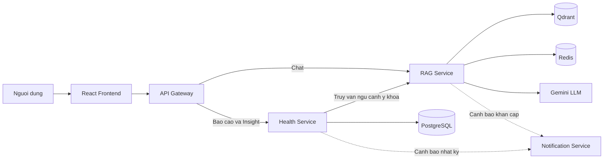

---

## 3. Tac nhan va quyen han

| Tac nhan | Vai tro |
|---|---|
| Nguoi dung | Gui cau hoi, xem cau tra loi, xem nguon, quan ly lich su chat, yeu cau ghi nho, phan tich nhat ky va tao AI Insight |
| Quan tri vien | Quan ly kho tri thuc RAG, tai tai lieu, xoa tai lieu, lap lai chi muc va xoa cache |
| API Gateway | Xac thuc request, dinh tuyen va gan ngu canh nguoi dung co chu ky |
| Health Service | Tong hop du lieu suc khoe, tao AI Insight, luu nhat ky va ket qua phan tich |
| RAG Service | Phan loai truy van, truy xuat ngu canh, goi LLM, quan ly session va phan tich nhat ky |
| Qdrant | Luu vector embedding va metadata cua tai lieu/tri thuc |
| Redis | Luu session, lich su chat dong bo va cache |
| Gemini LLM | Sinh cau tra loi, dien giai Insight va trich xuat phan tich nhat ky |
| Notification Service | Tiep nhan su kien va gui thong bao/canh bao |

---

# PHAN I. CHATBOT RAG

## 4. Danh sach use case Chatbot RAG

| Ma UC | Ten use case | Tac nhan chinh |
|---|---|---|
| RAG-UC01 | Hoi dap theo phien | Nguoi dung |
| RAG-UC02 | Xem nguon tham khao | Nguoi dung |
| RAG-UC03 | Quan ly lich su chat | Nguoi dung |
| RAG-UC04 | Ghi nho tri thuc/luat tra loi | Nguoi dung |
| RAG-UC05 | Phat hien tinh huong khan cap | Nguoi dung, he thong |
| RAG-UC06 | Phan tich nhat ky suc khoe | Nguoi dung |
| RAG-UC07 | Quan ly kho tri thuc | Quan tri vien |
| RAG-UC08 | Kiem tra trang thai RAG | Quan tri vien/he thong |

## 5. So do use case Chatbot RAG

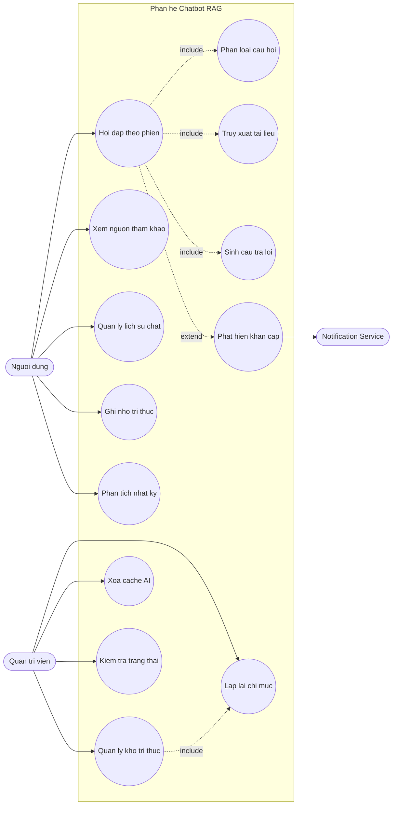

## 6. Kich ban chi tiet Chatbot RAG

### 6.1. RAG-UC01 - Hoi dap theo phien

| Thuoc tinh | Noi dung |
|---|---|
| Muc tieu | Cung cap cau tra loi co ngu canh va nguon tham khao cho cau hoi cua nguoi dung |
| Tac nhan | Nguoi dung |
| Tien dieu kien | Nguoi dung da dang nhap; Gateway va RAG Service dang hoat dong; kho vector da duoc khoi tao |
| Kich hoat | Nguoi dung nhap cau hoi va bam gui |
| Hau dieu kien | Cau hoi va cau tra loi duoc luu vao session; giao dien hien thi cau tra loi, metadata va nguon |

Luong chinh:

1. Nguoi dung mo trang `/user/chat`.
2. Frontend kiem tra suc khoe RAG qua `GET /api/rag/health`.
3. Nguoi dung nhap cau hoi co it nhat 3 ky tu.
4. Frontend gui `POST /api/rag/chat/session` gom `session_id`, `message`, `top_k` va `remember_knowledge`.
5. API Gateway xac thuc JWT, bo sung ngu canh nguoi dung da ky va chuyen request den RAG Service.
6. RAG Service lay toi da 8 luot hoi thoai gan nhat tu Redis.
7. He thong tim tri thuc ca nhan va quy tac tra loi lien quan.
8. Query Router phan loai cau hoi.
9. Voi cau hoi tai lieu, pipeline tim cac vector gan nhat trong Qdrant.
10. Voi cau hoi thuoc, pipeline co the bo sung du lieu OpenFDA.
11. LLM nhan cau hoi, lich su, tri thuc nguoi dung va cac doan tai lieu.
12. LLM sinh cau tra loi theo rang buoc an toan.
13. RAG Service luu cau hoi va cau tra loi vao session.
14. API tra `response`, `sources`, `chunks_used`, `response_time_ms` va `route_type`.
15. Frontend dinh dang noi dung, hien thi cau tra loi va luu snapshot lich su theo user.

Luong thay the:

- A1: Khong co `session_id` thi backend tao UUID moi.
- A2: Khong tim thay doan tai lieu phu hop thi LLM tra loi than trong hoac neu ro gioi han thong tin.
- A3: Cau hoi thuoc duoc dinh tuyen sang luong ket hop kho tai lieu va nguon du lieu thuoc.
- A4: Cau hoi nguy hiem duoc dinh tuyen sang `emergency`, van tao cau tra loi va dong thoi kich hoat canh bao.
- A5: Nguoi dung bat che do ghi nho thi he thong chuyen sang RAG-UC04.

Ngoai le:

- E1: JWT het han, frontend thu refresh token; neu khong thanh cong thi dang xuat.
- E2: RAG chua san sang, API tra 503.
- E3: LLM loi, API tra 502.
- E4: Xu ly noi bo loi, API tra 500 va giao dien cho phep thu lai.
- E5: Qua timeout 240 giay, frontend thong bao khong the nhan cau tra loi.

### 6.2. RAG-UC02 - Xem nguon tham khao

| Thuoc tinh | Noi dung |
|---|---|
| Muc tieu | Giup nguoi dung kiem tra co so thong tin cua cau tra loi |
| Tien dieu kien | Tin nhan tra ve co danh sach `sources` |
| Hau dieu kien | Nguoi dung xem duoc tieu de, URL, loai nguon va muc do tuong dong |

Luong chinh:

1. Frontend chuan hoa metadata nguon.
2. Cac nguon noi bo thuoc `user_knowledge` va `user_response_rule` khong duoc hien thi nhu tai lieu y khoa.
3. Nguoi dung bam nut xem nguon tren tin nhan.
4. Giao dien hien modal danh sach nguon.
5. Neu nguon co URL, nguoi dung co the mo trang goc.
6. Neu la PDF duoc lap chi muc, he thong co the mo qua `/documents/{filename}`.

### 6.3. RAG-UC03 - Quan ly lich su chat

Luong chinh:

1. Frontend tai lich su qua `GET /api/rag/chat/history/{user_key}`.
2. Redis tra ve `activeSessionId` va danh sach `sessions`.
3. Nguoi dung chon mot session de xem lai.
4. Khi co thay doi, frontend dong bo snapshot bang `PUT`.
5. Nguoi dung co the tao cuoc tro chuyen moi.
6. Nguoi dung co the xoa mot session bang endpoint xoa history.
7. Backend xoa ca context cua session va snapshot tuong ung.

Quy tac:

- Xoa session khong xoa tri thuc nguoi dung da ghi nho.
- Session memory va chat history snapshot la hai lop du lieu Redis co muc dich khac nhau.

### 6.4. RAG-UC04 - Ghi nho tri thuc hoac luat tra loi

| Thuoc tinh | Noi dung |
|---|---|
| Muc tieu | Cho phep chatbot su dung thong tin do nguoi dung chu dong cung cap trong cac lan chat sau |
| Tien dieu kien | Nguoi dung bat `remember_knowledge` hoac cau nhap co mau yeu cau ghi nho hop le |
| Hau dieu kien | Tri thuc duoc embedding va luu vao kho vector voi category phu hop |

Luong chinh:

1. Nguoi dung bat nut ghi nho va nhap noi dung.
2. RAG Service loai bo tien to dieu khien khoi noi dung.
3. He thong phan biet:
   - Tri thuc nguoi dung: `user_knowledge`.
   - Quy tac cach tra loi: `user_response_rule`.
4. Noi dung duoc chuan hoa.
5. Vector Store upsert noi dung vao Qdrant.
6. Chatbot tra xac nhan da ghi nho.
7. Cac session sau co the truy xuat noi dung nay theo do tuong dong.

Rang buoc:

- Tri thuc ghi nho co pham vi lau dai, khong gan rieng mot session.
- He thong loc quy tac bi gan nham de han che LLM sao chep huong dan vao cau tra loi.
- Thong tin ghi nho khong duoc hien nhu mot nguon y khoa ben ngoai.

### 6.5. RAG-UC05 - Phat hien tinh huong khan cap

Luong chinh:

1. Query Router phat hien tu khoa/trieu chung co nguy co.
2. Truy van duoc danh dau route `emergency`.
3. RAG tao cau tra loi uu tien huong dan hanh dong an toan, khong chan doan chac chan.
4. RAG Service tao su kien canh bao kem ngu canh nguoi dung do Gateway cung cap.
5. Notification Service xu ly su kien.
6. Nguoi dung nhan thong bao trong ung dung va/hoac email theo cau hinh.

Rang buoc an toan:

- Chatbot khong thay the bac si.
- Truong hop khan cap phai uu tien goi cap cuu hoặc lien he nhan vien y te.
- Khong cho phep cau tra loi dai lam che mo hanh dong can thiet.
- Neu gui canh bao that bai, cau tra loi cho nguoi dung van duoc tra ve.

### 6.6. RAG-UC06 - Phan tich nhat ky suc khoe

Luong chinh:

1. Nguoi dung nhap nhat ky co it nhat 10 ky tu.
2. Frontend goi `POST /api/journal/analyze/` den Health Service.
3. Health Service tao hoac cap nhat `JournalEntry`.
4. Health Service lay toi da 3 ket qua nhat ky gan day lam ngu canh.
5. Health Service goi noi bo `POST /journal/analyze` cua RAG Service.
6. RAG/LLM trich xuat trieu chung, xu huong, tan suat, muc can luu y va goi y theo doi.
7. Health Service kiem tra schema ket qua.
8. `JournalEntry.symptom_tags` duoc cap nhat.
9. `JournalAnalysis` duoc tao moi hoac cap nhat.
10. Neu muc can luu y khac `binh_thuong`, `risk_flag` duoc bat.
11. Health Service phat su kien thong bao.
12. Frontend hien thi panel phan tich va lich su.

Ngoai le:

- RAG chua cau hinh: Health Service tra 503.
- RAG timeout/khong truy cap duoc: tra 503.
- RAG tra JSON sai dinh dang: tra 502.
- Ghi notification loi khong lam that bai toan bo ket qua phan tich.

### 6.7. RAG-UC07 - Quan ly kho tri thuc

Tac nhan: Quan tri vien.

Chuc nang:

- Xem danh sach diem tri thuc: `GET /admin/knowledge`.
- Them tri thuc dang text: `POST /admin/knowledge`.
- Xoa mot diem tri thuc: `DELETE /admin/knowledge/{point_id}`.
- Upload tai lieu: `POST /admin/upload`.
- Xem danh sach tai lieu: `GET /admin/documents`.
- Xoa tai lieu: `DELETE /admin/documents/{document_id}`.
- Lap lai chi muc: `POST /admin/rebuild-index`.
- Xoa cache cau tra loi: `DELETE /admin/cache`.
- Xem thong ke cache: `GET /admin/cache/stats`.

## 7. So do tuan tu Chatbot RAG

### 7.1. Tuan tu hoi dap theo session

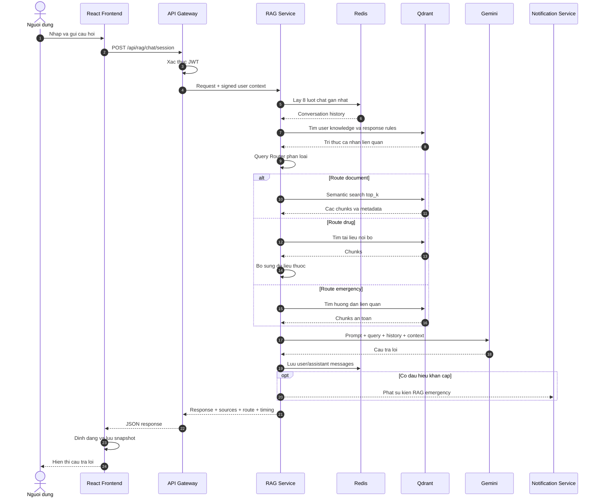

### 7.2. Tuan tu phan tich nhat ky

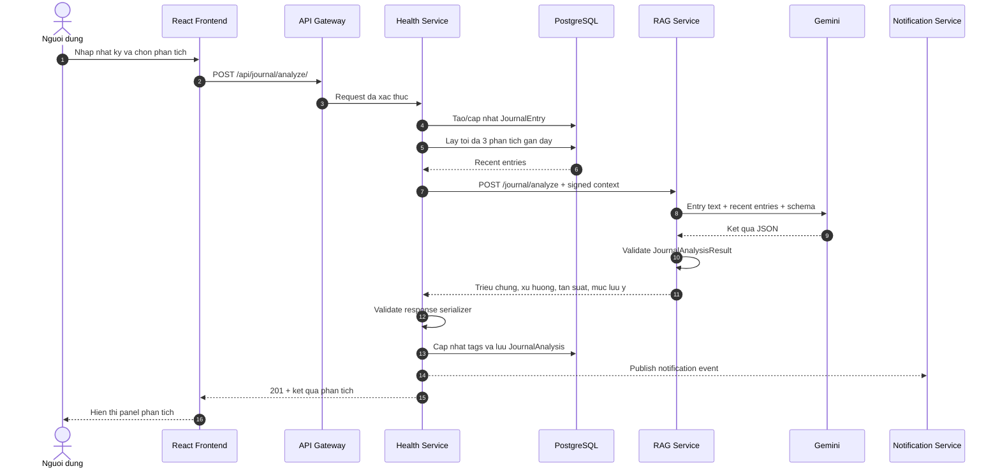

### 7.3. Tuan tu them tai lieu vao RAG

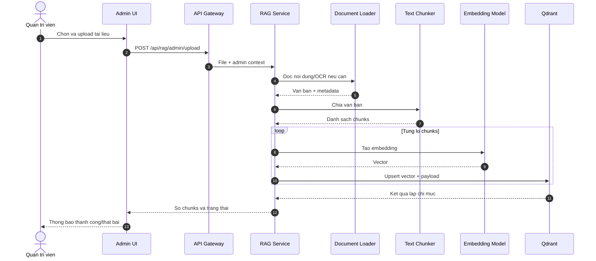

## 8. So do hoat dong Chatbot RAG

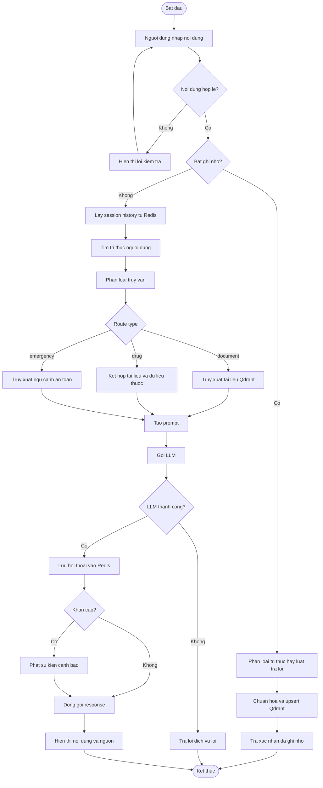

## 9. Cau truc thanh phan Chatbot RAG

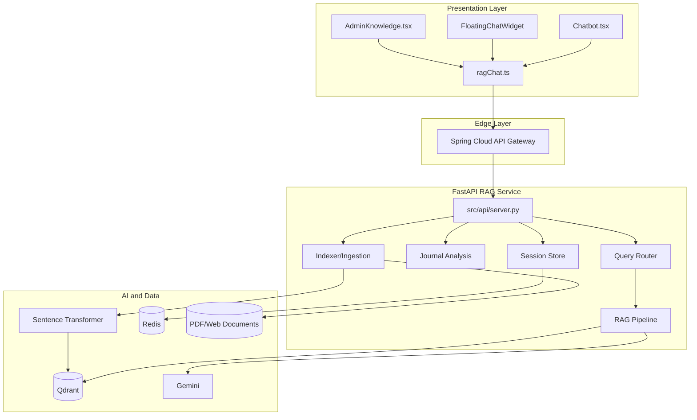

---

# PHAN II. AI INSIGHT

## 10. Danh sach use case AI Insight

| Ma UC | Ten use case | Tac nhan chinh |
|---|---|---|
| INS-UC01 | Xem AI Insight nhanh | Nguoi dung |
| INS-UC02 | Tao lai AI Insight chuyen sau | Nguoi dung |
| INS-UC03 | Bo sung ngu canh lam sang | Nguoi dung |
| INS-UC04 | Xem yeu to anh huong | Nguoi dung |
| INS-UC05 | Xem khuyen nghi va chi so uu tien | Nguoi dung |
| INS-UC06 | Danh dau can xem xet lam sang | He thong |
| INS-UC07 | Luu va tai su dung Insight | He thong |

## 11. So do use case AI Insight

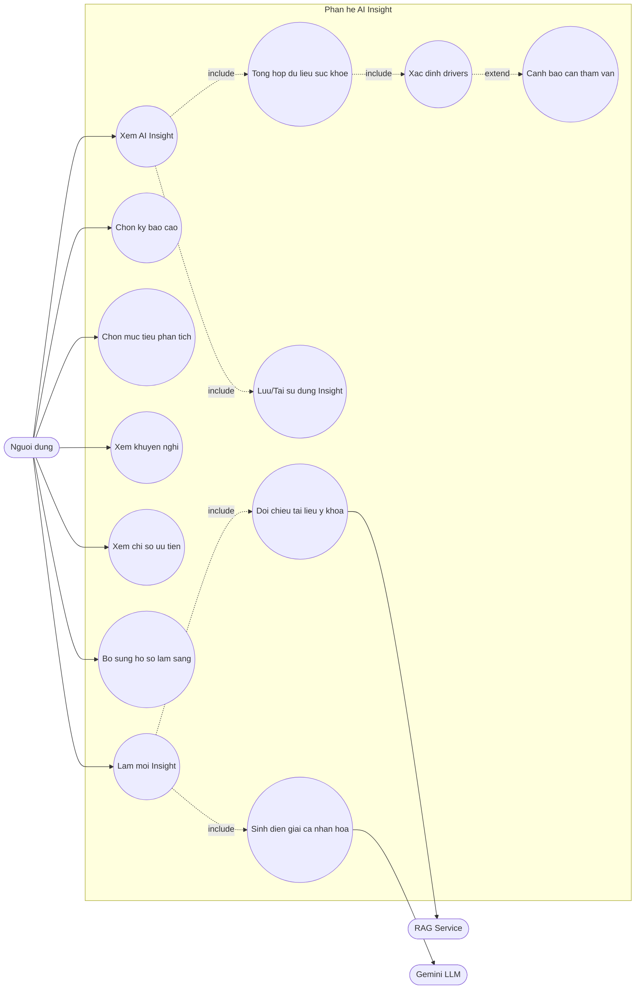

## 12. Kich ban chi tiet AI Insight

### 12.1. INS-UC01 - Xem AI Insight nhanh

| Thuoc tinh | Noi dung |
|---|---|
| Muc tieu | Tao phan tich nhanh tu du lieu suc khoe ma khong phu thuoc vao LLM |
| Tac nhan | Nguoi dung |
| Tien dieu kien | Nguoi dung da dang nhap; Health Service truy cap duoc PostgreSQL |
| Kich hoat | Nguoi dung mo bao cao va yeu cau AI Insight |
| Hau dieu kien | Insight duoc hien thi va co the duoc luu vao `ai_insights` |

Du lieu vao:

- `period_type`: `weekly` hoac `monthly`.
- `intent`: `advice` hoac `improve_metrics`.
- `force_refresh`: mac dinh `false`.

Luong chinh:

1. Frontend goi `POST /api/reports/ai-insights/`.
2. Health Service xac dinh nguoi dung tu ngu canh Gateway.
3. He thong tong hop dashboard theo ky bao cao.
4. He thong doc health profile, clinical context, baseline, assessment va prediction.
5. He thong chuan hoa cac chi so va danh gia chat luong du lieu.
6. Cac quy tac ca nhan hoa tao danh sach drivers.
7. He thong tao fingerprint cho ngu canh hien tai.
8. He thong tim Insight trung `insight_type`.
9. Neu co cache hop le, he thong tra ket qua cache.
10. Neu chua co, he thong tao ket qua nhanh bang quy tac local.
11. Ket qua duoc luu vao `ai_insights`.
12. Frontend hien thi tom tat, drivers, khuyen nghi, chi so uu tien va disclaimer.

Dieu dac biet:

- Luong nhanh dung model danh dau `local-fast-cache`.
- `rag_context.used` bang `false`.
- Ket qua van co the duoc tao khi ho so chua day du, nhung phai thong bao chat luong du lieu.

### 12.2. INS-UC02 - Tao lai AI Insight chuyen sau

| Thuoc tinh | Noi dung |
|---|---|
| Muc tieu | Tao phan tich moi co doi chieu RAG va dien giai boi LLM |
| Kich hoat | Nguoi dung chon lam moi; frontend gui `force_refresh=true` |
| Hau dieu kien | Mot ban Insight moi duoc luu, co metadata mo hinh va cac nguon RAG |

Luong chinh:

1. He thong xay dung local context nhu UC01.
2. He thong bo qua cache do `force_refresh=true`.
3. Health Service tao mot cau truy van y khoa tu cac drivers va patient context.
4. Neu nguoi dung dang mang thai hoac co bien chung, truy van duoc bo sung rang buoc tuong ung.
5. Health Service ky `X-User-Context` va goi `POST /chat` cua RAG Service.
6. RAG truy xuat cac tai lieu y khoa lien quan va sinh tom tat tham chieu.
7. Health Service ket hop:
   - Local context da tinh.
   - Patient context.
   - RAG summary.
   - RAG sources.
8. Health Service goi Gemini voi prompt khong duoc tu bia chi so va khong chan doan chac chan.
9. Ket qua LLM duoc validate va chuan hoa.
10. Neu LLM loi hoac sai dinh dang, he thong dung fallback local.
11. He thong luu `AiInsight`.
12. API tra ve ket qua va thong tin RAG.

### 12.3. INS-UC03 - Bo sung ngu canh lam sang

Nguoi dung co the cap nhat:

- Tinh trang tieu duong.
- Tinh trang thai ky va tuan thai.
- Tien su tieu duong thai ky.
- Che do dieu tri.
- Bien chung da xac nhan.

Luong:

1. Frontend doc `GET /api/clinical/context/`.
2. Nguoi dung sua thong tin.
3. Frontend gui `PUT /api/clinical/context/`.
4. Health Service validate gia tri.
5. `clinical_contexts` duoc cap nhat.
6. Fingerprint lan tao Insight tiep theo thay doi.
7. Insight moi duoc ca nhan hoa theo ngu canh vua cap nhat.

### 12.4. INS-UC04 - Xem yeu to anh huong

Moi driver co the gom:

- `key`: khoa chi so.
- `label`: ten hien thi.
- `reason`: ly do dua vao danh sach.
- `explanation`: dien giai bo sung.
- `severity`: `low`, `medium`, `high`.
- `direction`: chieu thay doi.
- `current_value`: gia tri hien tai.
- `baseline_value`: gia tri moc.
- `unit`: don vi.
- `is_abnormal`: co bat thuong hay khong.

He thong chi tra toi da 5 drivers uu tien trong local context. Frontend hien toi da 4 driver card tren phan Insight.

### 12.5. INS-UC05 - Xem khuyen nghi va chi so uu tien

Ket qua gom:

- `recommendations`: cac hanh dong de nguoi dung tham khao.
- `focus_metrics`: cac chi so can theo doi tiep.
- `summary`: tom tat tinh trang.
- `disclaimer`: canh bao gioi han cua AI.
- `requires_clinical_review`: danh dau can tham van chuyen mon.

Khuyen nghi phai:

- Dua tren du lieu da tinh san.
- Khong tu tao gia tri xet nghiem.
- Khong khang dinh chan doan.
- Phu hop voi ngu canh thai ky, phuong phap dieu tri va bien chung.
- Uu tien kham/tu van khi co dau hieu nguy co.

### 12.6. INS-UC06 - Danh dau can xem xet lam sang

He thong bat `requires_clinical_review` khi ngu canh cho thay can co danh gia cua nhan vien y te, vi du:

- Chi so nguy co cao.
- Du lieu bat thuong quan trong.
- Co thai ky kem van de theo doi duong huyet.
- Co bien chung da xac nhan.
- Ket qua AI khong du de ket luan an toan.

Day la co danh dau tren giao dien, khong phai mot chan doan.

### 12.7. INS-UC07 - Luu va tai su dung Insight

He thong tao `insight_type` tu:

```text
intent + period_type + personalization_rule_version + context_fingerprint
```

Fingerprint phan anh ngu canh local. Khi du lieu dau vao thay doi, fingerprint thay doi va cache cu khong con duoc xem la cung mot Insight.

Bang `ai_insights` luu:

- Nguoi dung.
- Assessment lien quan.
- Risk prediction noi bat.
- Loai Insight/fingerprint.
- Phan giai thich.
- Chuoi khuyen nghi.
- Ten model.
- Thoi gian tao.

## 13. So do tuan tu AI Insight

### 13.1. Tuan tu Insight nhanh va cache

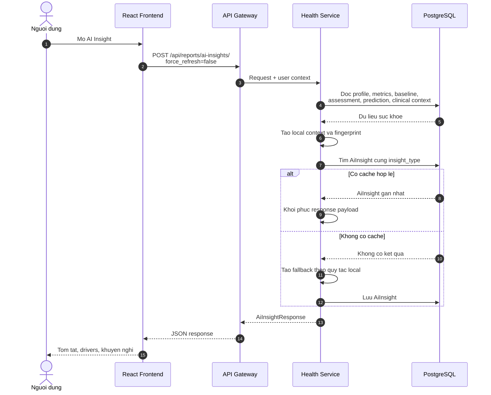

### 13.2. Tuan tu lam moi Insight co RAG va LLM

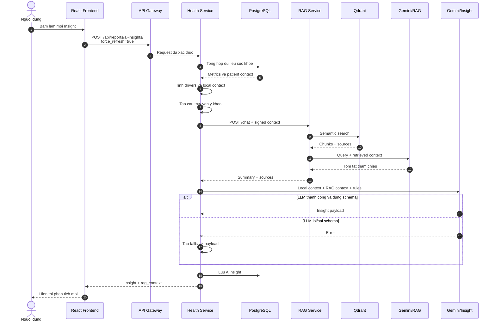

## 14. So do hoat dong AI Insight

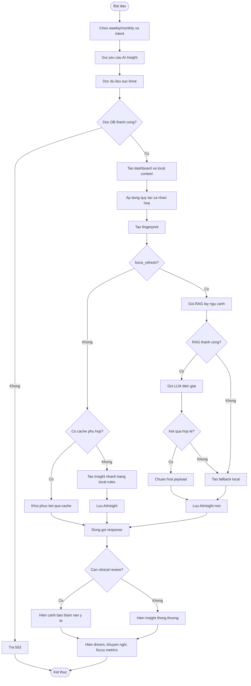

## 15. Cau truc thanh phan AI Insight

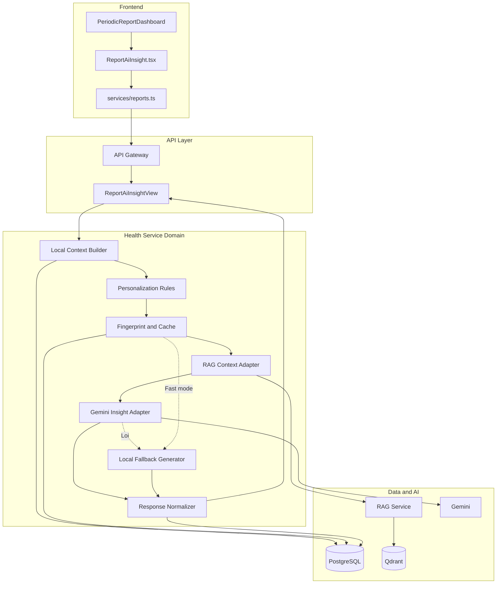

---

# PHAN III. CAU TRUC DU LIEU VA ERD

## 16. Pham vi luu tru

Hai phan he su dung ba kieu luu tru:

| Kho du lieu | Du lieu |
|---|---|
| PostgreSQL | Nguoi dung, ho so suc khoe, clinical context, glucose, assessment, prediction, AI Insight, nhat ky va ket qua phan tich |
| Qdrant | Vector chunks cua tai lieu, metadata nguon, tri thuc nguoi dung va quy tac tra loi |
| Redis | Lich su session, snapshot cac cuoc chat va cache RAG |

Qdrant va Redis khong phai CSDL quan he, vi vay quan he cua chung duoc the hien o muc logical data model, khong phai khoa ngoai SQL.

## 17. ERD PostgreSQL lien quan

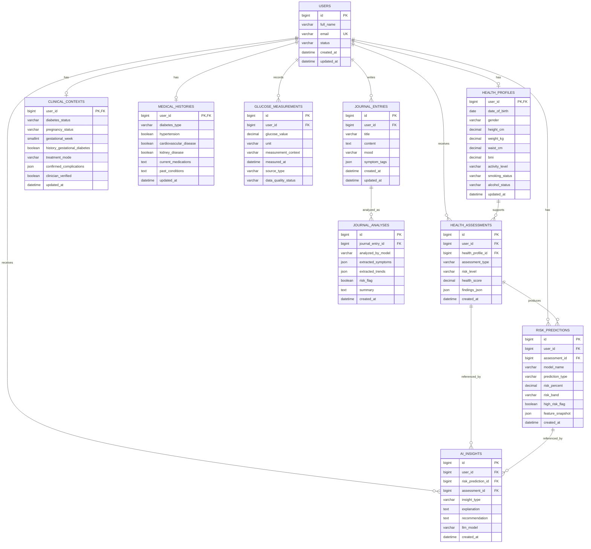

### 17.1. Giai thich quan he

| Quan he | Y nghia |
|---|---|
| `users` - `health_profiles` | Moi nguoi dung co toi da mot ho so suc khoe |
| `users` - `clinical_contexts` | Moi nguoi dung co toi da mot bo ngu canh lam sang |
| `users` - `glucose_measurements` | Mot nguoi dung co nhieu lan do duong huyet |
| `users` - `health_assessments` | Mot nguoi dung co nhieu dot danh gia |
| `health_assessments` - `risk_predictions` | Mot danh gia co the sinh nhieu ket qua du doan |
| `users` - `ai_insights` | Mot nguoi dung co nhieu phien ban Insight |
| `risk_predictions` - `ai_insights` | Insight co the tham chieu du doan noi bat |
| `health_assessments` - `ai_insights` | Insight co the tham chieu danh gia hien tai |
| `users` - `journal_entries` | Mot nguoi dung viet nhieu nhat ky |
| `journal_entries` - `journal_analyses` | Mot entry co the co lich su phan tich; logic hien tai uu tien cap nhat ban gan nhat |

## 18. Mo hinh du lieu logic Qdrant

Moi point trong Qdrant co dang tong quat:

```text
VectorPoint
├── id: UUID/point id
├── vector: float[]
└── payload
    ├── text: noi dung chunk
    ├── source: nguon
    ├── title/document_title
    ├── url/source_url
    ├── filename
    ├── category
    ├── chunk_index
    └── metadata bo sung
```

Category quan trong:

| Category | Y nghia |
|---|---|
| Tai lieu y khoa | Cac doan trich tu PDF, web hoac tai lieu quan tri upload |
| `user_knowledge` | Tri thuc do nguoi dung yeu cau ghi nho |
| `user_response_rule` | Quy tac dinh huong cach chatbot tra loi |

Quan he logic:

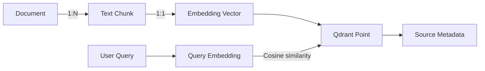

## 19. Mo hinh du lieu logic Redis

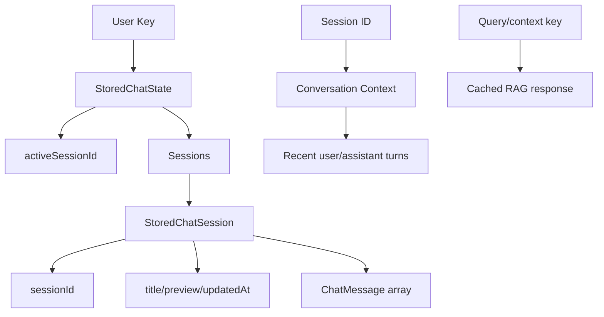

Phan biet:

- `StoredChatState`: phuc vu giao dien va dong bo danh sach cuoc tro chuyen theo nguoi dung.
- `Conversation Context`: phuc vu LLM nho cac luot hoi thoai gan day trong mot session.
- `RAG Cache`: giam so lan truy xuat va goi LLM voi truy van lap lai.

---

# PHAN IV. API VA HOP DONG DU LIEU

## 20. API Chatbot RAG chinh

| Method | Endpoint tu frontend | Muc dich |
|---|---|---|
| GET | `/api/rag/health` | Kiem tra RAG, Qdrant va session store |
| POST | `/api/rag/chat/session` | Hoi dap co session memory |
| DELETE | `/api/rag/chat/session/{session_id}` | Xoa context session |
| GET | `/api/rag/chat/history/{user_key}` | Lay snapshot lich su |
| PUT | `/api/rag/chat/history/{user_key}` | Luu snapshot lich su |
| DELETE | `/api/rag/chat/history/{user_key}/sessions/{session_id}` | Xoa mot cuoc chat |
| POST | `/api/journal/analyze/` | Phan tich nhat ky qua Health Service |

API RAG noi bo/bo sung:

| Method | Endpoint | Muc dich |
|---|---|---|
| POST | `/chat` | Hoi dap mot luot, duoc AI Insight su dung de lay RAG context |
| POST | `/chat/v2` | Hybrid RAG day du |
| POST | `/chat/stream` | Tra loi streaming SSE |
| POST | `/journal/analyze` | Phan tich nhat ky, khong tu luu DB |
| GET | `/search` | Tim kiem/debug retrieval |

Request hoi dap theo session:

```json
{
  "session_id": "uuid-session",
  "message": "Nguoi tieu duong nen theo doi duong huyet khi nao?",
  "top_k": 4,
  "remember_knowledge": false
}
```

Response:

```json
{
  "session_id": "uuid-session",
  "query": "Nguoi tieu duong nen theo doi duong huyet khi nao?",
  "response": "Noi dung tu van...",
  "sources": [],
  "chunks_used": 4,
  "response_time_ms": 1250,
  "route_type": "document"
}
```

## 21. API AI Insight

| Method | Endpoint | Muc dich |
|---|---|---|
| POST | `/api/reports/ai-insights/` | Tao hoac lay AI Insight |
| GET | `/api/reports/dashboard/` | Lay du lieu bao cao tong hop |
| GET | `/api/clinical/context/` | Lay ngu canh lam sang |
| PUT | `/api/clinical/context/` | Cap nhat ngu canh lam sang |

Request:

```json
{
  "intent": "improve_metrics",
  "period_type": "weekly",
  "force_refresh": true
}
```

Cau truc response chinh:

```json
{
  "title": "Phan tich suc khoe",
  "summary": "Tom tat ca nhan hoa...",
  "drivers": [],
  "recommendations": [],
  "focus_metrics": [],
  "disclaimer": "Thong tin chi mang tinh tham khao...",
  "llm_model": "model-name",
  "generated_at": "ISO-8601",
  "patient_context": {},
  "requires_clinical_review": false,
  "personalization_version": "version",
  "rag_context": {
    "used": true,
    "chunks_used": 4,
    "sources": []
  }
}
```

---

# PHAN V. QUY TAC, BAO MAT VA PHI CHUC NANG

## 22. Quy tac nghiep vu quan trong

1. Chatbot chi nhan cau hoi tu 3 den 8000 ky tu.
2. Phan tich nhat ky chi nhan noi dung tu 10 den 5000 ky tu.
3. `top_k` duoc gioi han de kiem soat tai nguyen va kich thuoc prompt.
4. Session chat chi dua mot so luot gan nhat vao prompt.
5. Xoa session khong xoa tri thuc da ghi nho.
6. RAG Service khong luu Journal Entry; Health Service la noi so huu du lieu nay.
7. AI Insight dung du lieu backend da tinh, LLM chi dien giai va khong duoc bia chi so.
8. `force_refresh=false` uu tien cache/local fast path.
9. `force_refresh=true` kich hoat RAG va LLM.
10. Ket qua AI phai co disclaimer va khong thay the chan doan y khoa.

## 23. Bao mat

- Frontend gui JWT den API Gateway.
- Gateway xac thuc va dinh tuyen request.
- Giao tiep noi bo den RAG co `X-User-Context` va `X-User-Context-Signature`.
- Chu ky duoc tao bang HMAC voi `GATEWAY_INTERNAL_SECRET`.
- RAG middleware chan request noi bo khong co chu ky hop le.
- Cac endpoint quan tri can quyen admin.
- Ten file PDF duoc chuan hoa de tranh path traversal.
- Khong dua secret, token hay bien moi truong vao sources va response AI.
- Du lieu suc khoe chi duoc truy van theo user id da xac thuc.

## 24. Yeu cau phi chuc nang

### 24.1. Hieu nang

- Frontend cho phep chat timeout toi 240 giay.
- AI Insight nhanh co timeout ngan hon va uu tien cache.
- Redis giam truy van lap va duy tri session nhanh.
- Qdrant ho tro semantic search tren tap vector lon.
- Cac tac vu dong bo nang duoc dua vao thread trong FastAPI khi can.

### 24.2. Tin cay

- Neu LLM cua AI Insight loi, he thong co fallback theo quy tac local.
- Neu notification loi, ket qua chinh van duoc tra cho nguoi dung.
- Response tu RAG khi phan tich nhat ky phai qua validation hai lop.
- Cac service co health endpoint de giam sat.

### 24.3. Kha nang giai thich

- Chatbot tra danh sach sources va similarity.
- AI Insight tra drivers, reason, severity va focus metrics.
- RAG context cho biet co su dung tai lieu hay khong.
- Ket qua luu model name va generated time.

### 24.4. Kha nang mo rong

- RAG Service tach khoi Health Service nen co the scale doc lap.
- Embedding model, vector store va LLM duoc tach thanh cac module.
- Co the bo sung nguon tai lieu moi qua ingestion/indexer.
- Rule version va fingerprint giup thay doi logic ca nhan hoa ma khong dung nham cache cu.

## 25. Cac diem can neu trong bao cao

### 25.1. Gia tri cua Chatbot RAG

- Cau tra loi co co so tu kho tai lieu cua he thong.
- Nguoi dung co the xem nguon de tang tinh minh bach.
- Session memory tao trai nghiem hoi dap lien tuc.
- Query routing giup xu ly rieng cau hoi thuoc va tinh huong khan cap.
- Kho tri thuc co the duoc quan tri ma khong can sua ma nguon.

### 25.2. Gia tri cua AI Insight

- Chuyen du lieu suc khoe roi rac thanh thong tin de hieu.
- Ket hop quy tac co cau truc voi kha nang dien giai cua LLM.
- Khong phu thuoc hoan toan vao AI sinh: van co fast path va fallback.
- Ca nhan hoa theo ho so va ngu canh lam sang.
- Fingerprint va cache giup can bang giua toc do, chi phi va do moi cua ket qua.

### 25.3. Gioi han

- Ket qua AI phu thuoc chat luong va do day du cua du lieu dau vao.
- Similarity cao khong dong nghia tai lieu chac chan dung ve mat lam sang.
- LLM co the sinh noi dung khong mong muon, do do can prompt, validation va disclaimer.
- Chatbot khong thay the chan doan, ke don hoac xu tri cap cuu.
- Tri thuc nguoi dung ghi nho can co co che quan ly/xoa ro rang khi dua vao san pham thuc te.

---

## 26. Ket luan

Chatbot RAG va AI Insight cung su dung AI ngon ngu nhung giai quyet hai bai toan khac nhau:

- Chatbot RAG bat dau tu **cau hoi**, truy xuat **tai lieu lien quan** va tao **cau tra loi co nguon**.
- AI Insight bat dau tu **du lieu suc khoe co cau truc**, ap dung **quy tac phan tich**, co the dung RAG de doi chieu va dung LLM de tao **dien giai ca nhan hoa**.

Viec tach hai phan he giup kien truc ro rang: RAG Service chiu trach nhiem tri thuc va hoi dap; Health Service chiu trach nhiem du lieu suc khoe, quy tac nghiep vu, ket qua Insight va luu tru quan he. Cach thiet ke nay tang kha nang bao tri, mo rong, kiem soat an toan va giai thich ket qua AI.
