# USE CASE TONG QUAT VA ERD TOAN BO HE THONG

## 1. Pham vi

Tai lieu mo ta hai loai so do tong quat cua du an HealthCare Diabetes:

- So do Use Case tong quat cua toan he thong.
- So do ERD tong hop va ERD chi tiet theo tung mien du lieu.

He thong gom cac phan he:

1. Tai khoan, xac thuc va phan quyen.
2. Ho so suc khoe va benh su.
3. Theo doi chi so suc khoe.
4. Chan doan va du doan nguy co bang ML.
5. Tai lieu lam sang va OCR.
6. Baseline va so sanh ket qua.
7. Dinh duong, mon an va lich su bua an.
8. AI Vision nhan dien bua an.
9. Bao cao dinh ky va AI Insight.
10. Chatbot RAG va phan tich nhat ky.
11. Nhac nho, canh bao va thong bao.
12. Quan tri nguoi dung, du lieu dinh duong va kho tri thuc AI.

---

## 2. Tac nhan toan he thong

| Tac nhan | Mo ta |
|---|---|
| Khach | Nguoi chua dang nhap, co the dang ky, dang nhap va khoi phuc mat khau |
| Nguoi dung | Nguoi su dung cac chuc nang cham soc va theo doi suc khoe |
| Quan tri vien | Quan ly nguoi dung, du lieu dinh duong, AI Vision va kho tri thuc RAG |
| Nhan vien y te | Tac nhan nghiep vu mo rong: kiem tra/doi chieu thong tin lam sang; hien chua co giao dien vai tro rieng |
| Gemini AI | Sinh noi dung, phan tich anh bua an, RAG va AI Insight |
| Google Vision/OCR | Trich xuat van ban, chi so tu anh va tai lieu |
| Dich vu email | Gui OTP, nhac nho va canh bao |
| Scheduler/Worker | Xu ly lich nhac, su kien, job AI Vision va canh bao bat dong bo |

> Trong phien ban hien tai, vai tro giao dien chinh la `USER` va `ADMIN`. Nhan vien y te duoc the hien nhu tac nhan nghiep vu mo rong vi mo hinh du lieu co cac truong xac minh lam sang, nhung frontend chua co khu vuc clinician rieng.

---

## 3. So do Use Case tong quat

```mermaid
flowchart LR
    Guest([Khach])
    User([Nguoi dung])
    Admin([Quan tri vien])
    Clinician([Nhan vien y te])
    AI([Gemini AI])
    OCR([Google Vision / OCR])
    Mail([Dich vu Email])
    Worker([Scheduler / Worker])

    subgraph System[HE THONG HEALTHCARE DIABETES]
        subgraph Account[1. Tai khoan va bao mat]
            UC01((Dang ky tai khoan))
            UC02((Dang nhap / dang xuat))
            UC03((Xac thuc OTP))
            UC04((Khoi phuc / doi mat khau))
            UC05((Cap nhat thong tin ca nhan))
            UC06((Quan ly phien va presence))
        end

        subgraph Health[2. Suc khoe va chan doan]
            UC07((Quan ly ho so suc khoe))
            UC08((Quan ly benh su))
            UC09((Ghi nhan duong huyet))
            UC10((Dat muc tieu suc khoe))
            UC11((Xem tong quan suc khoe))
            UC12((Du doan nguy co benh))
            UC13((Xem ket qua chan doan))
            UC14((Quan ly ngu canh lam sang))
        end

        subgraph Clinical[3. Tai lieu lam sang va OCR]
            UC15((Tai tai lieu / anh chi so))
            UC16((Trich xuat OCR))
            UC17((Xac nhan ket qua trich xuat))
            UC18((Tao baseline lam sang))
            UC19((So sanh voi baseline))
            UC20((Theo doi thai ky))
        end

        subgraph Nutrition[4. Dinh duong]
            UC21((Xem goi y mon an))
            UC22((Lap thuc don hang ngay))
            UC23((Tra cuu mon an / nguyen lieu))
            UC24((Ghi lich su bua an))
            UC25((Phan tich anh bua an AI))
        end

        subgraph Reports[5. Bao cao va AI Insight]
            UC26((Xem bao cao tuan / thang))
            UC27((Luu ban nhap bao cao))
            UC28((Xuat PDF / CSV))
            UC29((Tao AI Insight))
            UC30((Xem canh bao suc khoe))
        end

        subgraph Rag[6. Tro ly AI va nhat ky]
            UC31((Hoi dap Chatbot RAG))
            UC32((Xem nguon tham khao))
            UC33((Quan ly lich su chat))
            UC34((Ghi nho tri thuc ca nhan))
            UC35((Phan tich nhat ky suc khoe))
            UC36((Phat hien tinh huong khan cap))
        end

        subgraph Notify[7. Nhac nho va thong bao]
            UC37((Quan ly nhac nho))
            UC38((Nhan thong bao realtime))
            UC39((Danh dau da doc))
            UC40((Nhan email nhac / canh bao))
        end

        subgraph Administration[8. Quan tri he thong]
            UC41((Quan ly nguoi dung va vai tro))
            UC42((Quan ly nguyen lieu))
            UC43((Quan ly mau mon an))
            UC44((Giam sat job AI Vision))
            UC45((Quan ly kho tri thuc RAG))
            UC46((Lap lai chi muc / xoa cache))
            UC47((Giam sat hoat dong dich vu))
        end
    end

    Guest --> UC01
    Guest --> UC02
    Guest --> UC03
    Guest --> UC04
    UC01 -. include .-> UC03
    UC04 -. include .-> UC03

    User --> UC02
    User --> UC04
    User --> UC05
    User --> UC06
    User --> UC07
    User --> UC08
    User --> UC09
    User --> UC10
    User --> UC11
    User --> UC12
    User --> UC13
    User --> UC14
    User --> UC15
    User --> UC17
    User --> UC18
    User --> UC19
    User --> UC20
    User --> UC21
    User --> UC22
    User --> UC23
    User --> UC24
    User --> UC25
    User --> UC26
    User --> UC27
    User --> UC28
    User --> UC29
    User --> UC30
    User --> UC31
    User --> UC32
    User --> UC33
    User --> UC34
    User --> UC35
    User --> UC37
    User --> UC38
    User --> UC39
    User --> UC40

    UC12 -. include .-> UC07
    UC12 -. include .-> UC13
    UC15 -. include .-> UC16
    UC18 -. include .-> UC17
    UC19 -. include .-> UC18
    UC25 -. extend .-> UC24
    UC26 -. include .-> UC11
    UC29 -. include .-> UC26
    UC31 -. include .-> UC32
    UC31 -. extend .-> UC36
    UC35 -. extend .-> UC30
    UC36 -. include .-> UC38
    UC37 -. include .-> UC38
    UC38 -. extend .-> UC40

    Admin --> UC41
    Admin --> UC42
    Admin --> UC43
    Admin --> UC44
    Admin --> UC45
    Admin --> UC46
    Admin --> UC47

    Clinician --> UC17
    Clinician --> UC18
    Clinician --> UC19

    AI --> UC25
    AI --> UC29
    AI --> UC31
    AI --> UC35
    OCR --> UC16
    Mail --> UC03
    Mail --> UC40
    Worker --> UC25
    Worker --> UC37
    Worker --> UC38
```

### 3.1. Nhom Use Case cua khach

- Dang ky tai khoan.
- Xac thuc email bang OTP.
- Dang nhap.
- Kiem tra email va dat lai mat khau.

### 3.2. Nhom Use Case cua nguoi dung

- Quan ly tai khoan va ho so.
- Theo doi duong huyet, BMI, muc tieu va tong quan suc khoe.
- Thuc hien phien chan doan va xem du doan nguy co.
- Tai tai lieu lam sang, OCR va tao baseline.
- Nhan goi y dinh duong, luu bua an va phan tich anh.
- Xem bao cao, xuat file va tao AI Insight.
- Hoi chatbot, xem nguon, quan ly lich su va phan tich nhat ky.
- Tao lich nhac, nhan thong bao realtime/email.

### 3.3. Nhom Use Case cua quan tri vien

- Tim kiem, khoa/mo tai khoan va cap nhat role.
- Quan ly danh muc nguyen lieu.
- Quan ly mau mon an va nhom nguoi dung phu hop.
- Theo doi job phan tich anh AI.
- Them/xoa tai lieu va tri thuc RAG.
- Rebuild vector index, xoa cache va theo doi trang thai dich vu.

---

## 4. Ranh gioi du lieu

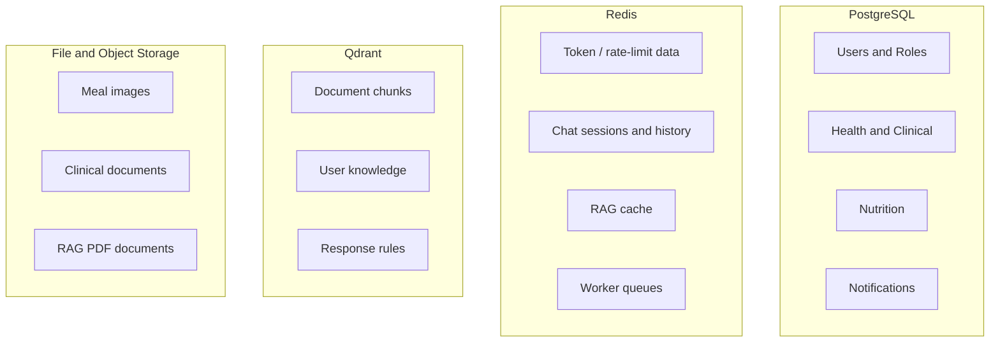

Ghi chu:

- Cac bang nghiep vu quan he nam trong PostgreSQL.
- Redis va Qdrant khong nam trong ERD vat ly cua PostgreSQL.
- ERD tong hop ben duoi van bieu dien lien ket logic giua cac mien qua `user_id` va event id.

---

## 5. ERD tong quat toan he thong

So do nay rut gon moi bang ve cac khoa va thuoc tinh quan trong nhat.

```mermaid
erDiagram
    USERS ||--o{ USERS_ROLES : assigned
    ROLES ||--o{ USERS_ROLES : contains

    USERS ||--o| HEALTH_PROFILES : owns
    USERS ||--o| MEDICAL_HISTORIES : owns
    USERS ||--o| CLINICAL_CONTEXTS : owns
    USERS ||--o{ HEALTH_GOALS : sets
    USERS ||--o{ GLUCOSE_MEASUREMENTS : records
    USERS ||--o{ DIAGNOSIS_SESSIONS : starts
    USERS ||--o{ HEALTH_ASSESSMENTS : receives
    USERS ||--o{ RISK_PREDICTIONS : receives
    USERS ||--o{ AI_INSIGHTS : receives
    USERS ||--o{ PERIODIC_REPORTS : owns
    USERS ||--o{ REPORT_DRAFTS : owns
    USERS ||--o{ JOURNAL_ENTRIES : writes
    USERS ||--o{ HEALTH_ALERTS : receives

    HEALTH_PROFILES ||--o{ HEALTH_ASSESSMENTS : supports
    HEALTH_ASSESSMENTS ||--o{ RISK_PREDICTIONS : produces
    HEALTH_ASSESSMENTS ||--o{ AI_INSIGHTS : explains
    RISK_PREDICTIONS ||--o{ AI_INSIGHTS : explains

    DIAGNOSIS_SESSIONS ||--o{ CLINICAL_DOCUMENTS : contains
    DIAGNOSIS_SESSIONS ||--o{ LAB_PANELS : contains
    DIAGNOSIS_SESSIONS ||--o{ CLINICAL_OBSERVATIONS : contains
    DIAGNOSIS_SESSIONS ||--o| CLINICAL_BASELINES : establishes
    CLINICAL_DOCUMENTS ||--o{ LAB_PANELS : extracted_to
    CLINICAL_DOCUMENTS ||--o{ CLINICAL_OBSERVATIONS : extracted_to
    LAB_PANELS ||--o{ LAB_RESULTS : contains
    CLINICAL_BASELINES ||--o| PREGNANCY_HEALTH_RECORDS : contextualizes
    CLINICAL_BASELINES ||--o{ CLINICAL_CONCLUSIONS : has
    CLINICAL_BASELINES ||--o{ BASELINE_COMPARISONS : compared_in
    DIAGNOSIS_SESSIONS ||--o{ BASELINE_COMPARISONS : produces

    PERIODIC_REPORTS ||--o{ REPORT_EXPORTS : exported_as
    JOURNAL_ENTRIES ||--o{ JOURNAL_ANALYSES : analyzed_as

    USERS ||--o{ MEAL_HISTORY : logs
    NUTRITION_MEAL_TEMPLATES ||--o{ MEAL_TEMPLATE_USER_TYPES : mapped
    NUTRITION_USER_TYPES ||--o{ MEAL_TEMPLATE_USER_TYPES : mapped

    USERS ||--o{ REMINDERS : creates
    REMINDERS ||--o{ REMINDER_EXECUTIONS : schedules
    REMINDER_EXECUTIONS ||--o{ NOTIFICATIONS : produces
    USERS ||--o{ NOTIFICATIONS : receives
    HEALTH_OUTBOX_EVENTS ||--o| INBOX_EVENTS : delivered_as

    USERS {
        bigint id PK
        varchar email UK
        varchar full_name
        varchar status
    }
    ROLES {
        bigint id PK
        varchar name
    }
    USERS_ROLES {
        bigint user_id FK
        bigint role_id FK
    }
    HEALTH_PROFILES {
        bigint user_id PK,FK
        decimal height_cm
        decimal weight_kg
        decimal bmi
    }
    MEDICAL_HISTORIES {
        bigint user_id PK,FK
        varchar diabetes_type
        text current_medications
    }
    CLINICAL_CONTEXTS {
        bigint user_id PK,FK
        varchar diabetes_status
        varchar treatment_mode
        json confirmed_complications
    }
    HEALTH_GOALS {
        bigint id PK
        bigint user_id FK
        varchar goal_type
        decimal target_value
    }
    GLUCOSE_MEASUREMENTS {
        bigint id PK
        bigint user_id FK
        decimal glucose_value
        datetime measured_at
    }
    DIAGNOSIS_SESSIONS {
        bigint id PK
        bigint user_id FK
        bigint baseline_id FK
        varchar status
    }
    HEALTH_ASSESSMENTS {
        bigint id PK
        bigint user_id FK
        decimal health_score
        varchar risk_level
    }
    RISK_PREDICTIONS {
        bigint id PK
        bigint assessment_id FK
        decimal risk_percent
        varchar risk_band
    }
    AI_INSIGHTS {
        bigint id PK
        bigint user_id FK
        bigint assessment_id FK
        bigint risk_prediction_id FK
    }
    CLINICAL_DOCUMENTS {
        bigint id PK
        bigint user_id FK
        bigint diagnosis_session_id FK
        varchar verification_status
    }
    LAB_PANELS {
        bigint id PK
        bigint clinical_document_id FK
        bigint diagnosis_session_id FK
    }
    LAB_RESULTS {
        bigint id PK
        bigint lab_panel_id FK
        varchar test_code
        decimal value
    }
    CLINICAL_OBSERVATIONS {
        bigint id PK
        bigint diagnosis_session_id FK
        varchar observation_code
        decimal value
    }
    CLINICAL_BASELINES {
        bigint id PK
        bigint user_id FK
        bigint diagnosis_session_id FK
        varchar status
    }
    PREGNANCY_HEALTH_RECORDS {
        bigint id PK
        bigint user_id FK
        bigint clinical_baseline_id FK
    }
    CLINICAL_CONCLUSIONS {
        bigint id PK
        bigint clinical_baseline_id FK
        varchar condition_code
    }
    BASELINE_COMPARISONS {
        bigint id PK
        bigint clinical_baseline_id FK
        bigint diagnosis_session_id FK
        decimal delta_value
    }
    PERIODIC_REPORTS {
        bigint id PK
        bigint user_id FK
        varchar period_type
        decimal health_score
    }
    REPORT_EXPORTS {
        bigint id PK
        bigint report_id FK
        bigint user_id FK
        varchar export_format
    }
    REPORT_DRAFTS {
        bigint id PK
        bigint user_id FK
        json payload
    }
    JOURNAL_ENTRIES {
        bigint id PK
        bigint user_id FK
        text content
    }
    JOURNAL_ANALYSES {
        bigint id PK
        bigint journal_entry_id FK
        boolean risk_flag
    }
    HEALTH_ALERTS {
        bigint id PK
        bigint user_id FK
        varchar severity
        varchar status
    }
    HEALTH_OUTBOX_EVENTS {
        uuid event_id PK
        varchar event_type
        varchar status
    }
    INGREDIENT {
        bigint id PK
        varchar food_name
        decimal calories
    }
    NUTRITION_MEAL_TEMPLATES {
        bigint id PK
        varchar name
        integer calories
        varchar meal_type
    }
    NUTRITION_USER_TYPES {
        bigint id PK
        varchar type_user UK
    }
    MEAL_TEMPLATE_USER_TYPES {
        bigint meal_template_id FK
        bigint user_type_id FK
    }
    MEAL_HISTORY {
        bigint id PK
        bigint user_id
        varchar analysis_status
        decimal total_calories
    }
    REMINDERS {
        bigint id PK
        bigint user_id
        varchar reminder_type
        datetime next_run_at
    }
    REMINDER_EXECUTIONS {
        bigint id PK
        bigint reminder_id FK
        bigint user_id
        varchar status
    }
    NOTIFICATIONS {
        bigint id PK
        bigint user_id
        bigint reminder_execution_id FK
        uuid source_event_id
        boolean is_read
    }
    INBOX_EVENTS {
        uuid event_id PK
        varchar source_service
        varchar event_type
    }
```

> `INGREDIENT` hien tai la danh muc dinh duong doc lap; entity khong khai bao bang trung gian lien ket truc tiep voi `NUTRITION_MEAL_TEMPLATES`. Truong `ingredients` trong mau mon an dang duoc luu dang text.

---

## 6. ERD mien Tai khoan va phan quyen

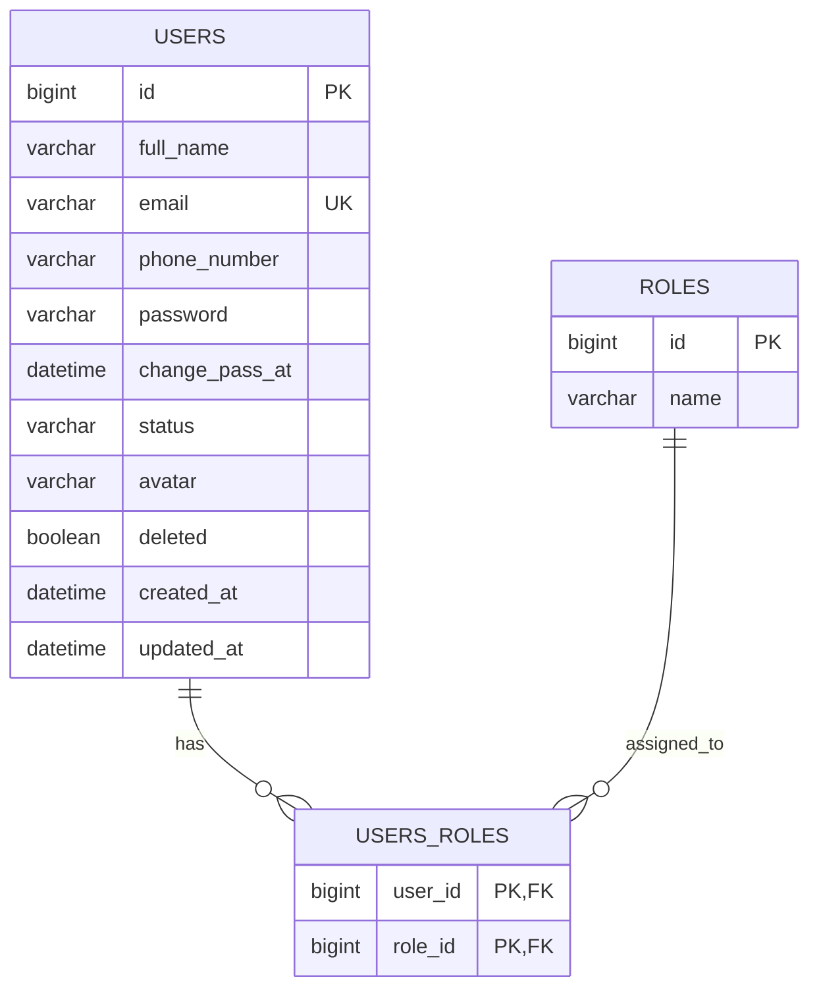

Quan he:

- `users` va `roles` co quan he nhieu-nhieu qua `users_roles`.
- Mot tai khoan co the co mot hoac nhieu role.
- `users.id` la dinh danh nguoi dung duoc cac service khac tham chieu.

---

## 7. ERD mien Suc khoe, chan doan va bao cao

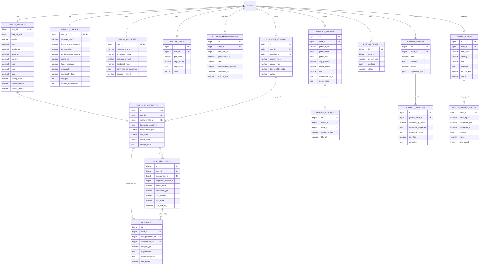

Ghi chu:

- `diagnosis_session_id` trong mot so bang la ID logic, khong phai model nao cung khai bao `ForeignKey`.
- `meal_log_id` trong `glucose_measurements` ket noi logic den bua an cua Nutrition Service.
- `HealthOutboxEvent` luu su kien cho Notification Service theo Outbox/Inbox pattern.

---

## 8. ERD mien Tai lieu lam sang va baseline

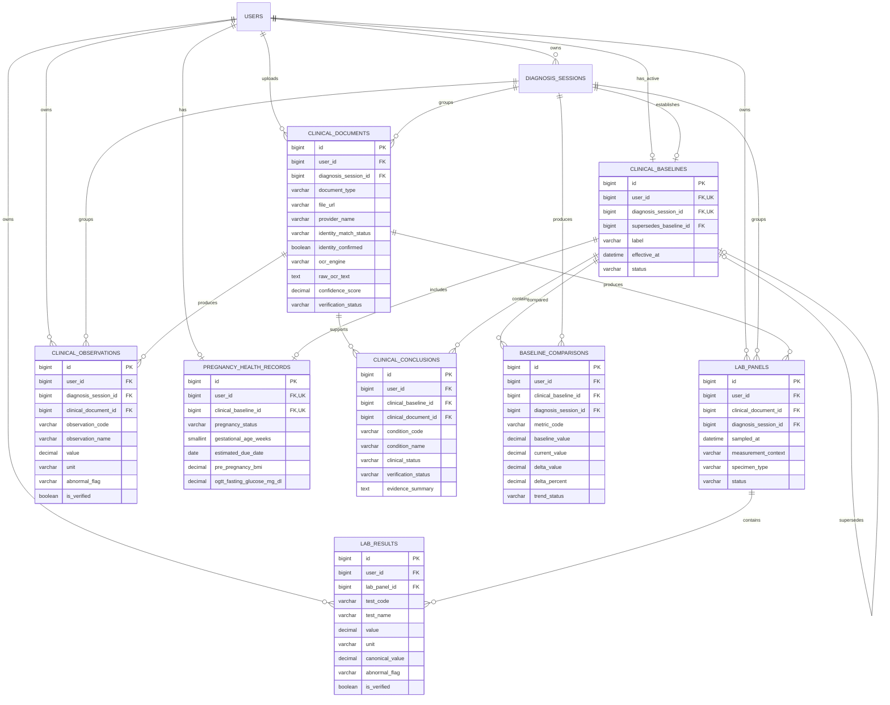

---

## 9. ERD mien Dinh duong va AI Vision

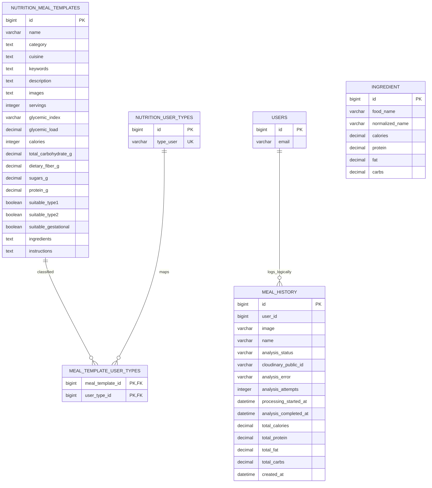

Luu y:

- `meal_history.user_id` tham chieu logic den `users.id`.
- Mot ban ghi `meal_history` dong thoi la lich su bua an va job AI Vision; trang thai gom cac giai doan nhu `PENDING`, `PROCESSING`, `COMPLETED`, `FAILED`.
- Anh bua an duoc luu ngoai CSDL; bang chi luu URL va `cloudinary_public_id`.
- `ingredient` chua co FK den meal template trong entity hien tai.

---

## 10. ERD mien Nhac nho va thong bao

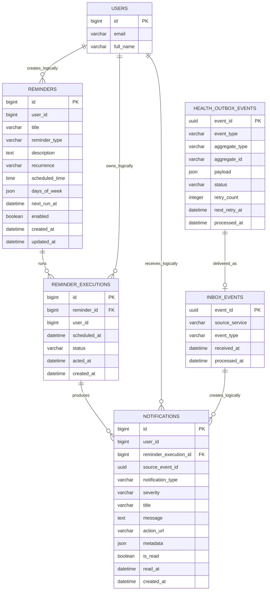

Quy tac:

- Cap `reminder_id + scheduled_at` cua `reminder_executions` la duy nhat de tranh gui trung.
- `source_event_id` ket noi notification voi su kien noi bo.
- `inbox_events.event_id` giup Notification Service xu ly idempotent.
- Thong bao co the den tu reminder, health alert, nhat ky hoac RAG emergency.

---

## 11. Mo hinh du lieu RAG ngoai PostgreSQL

RAG khong su dung ERD quan he cho tai lieu va session. Mo hinh logic:

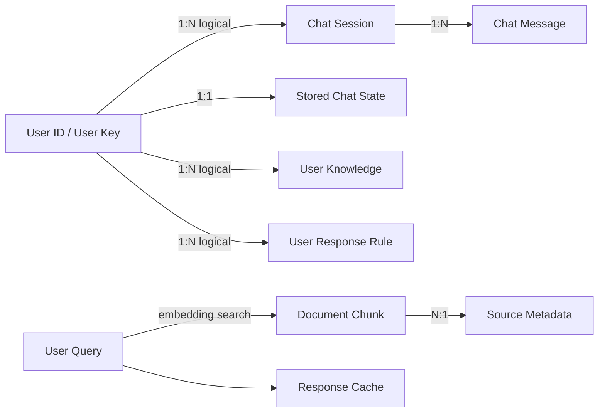

Noi luu:

| Du lieu | Kho |
|---|---|
| Session va cac luot chat gan nhat | Redis |
| Snapshot danh sach cuoc chat theo user | Redis |
| Cache cau tra loi | Redis |
| Document chunk va embedding | Qdrant |
| Tri thuc nguoi dung | Qdrant |
| Quy tac tra loi nguoi dung | Qdrant |
| PDF nguon | File volume `data/pdfs` |

---

## 12. Quan he lien microservice

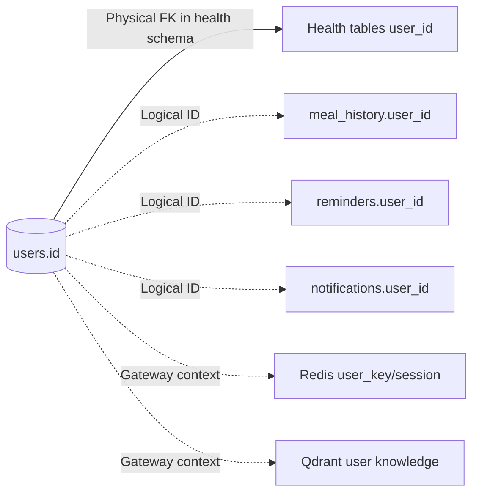

Giai thich:

- Health Service co Django model `User` tro den cung bang `users` va nhieu quan he FK.
- Nutrition va Notification luu `user_id` dang `Long`, khong map `@ManyToOne` den `UserEntity`.
- RAG nhan danh tinh tu header noi bo do Gateway ky.
- Cach tach nay giam phu thuoc code giua service, nhung can dam bao user id nhat quan.

---

## 13. Luong du lieu tong quat

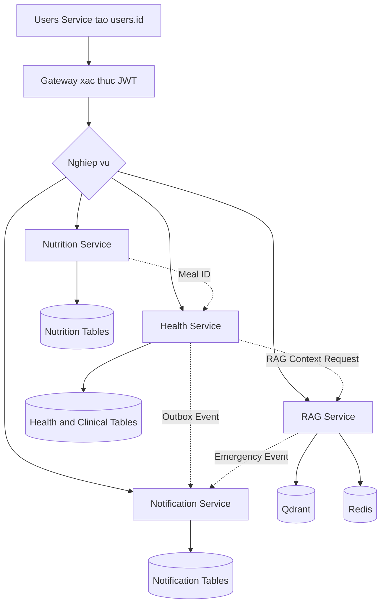

---

## 14. Ket luan dung trong bao cao

Use Case tong quat cho thay he thong co hai tac nhan giao dien chinh la nguoi dung va quan tri vien. Nguoi dung tuong tac voi chuoi chuc nang cham soc suc khoe lien hoan, tu ho so, duong huyet, chan doan, tai lieu lam sang, dinh duong den bao cao, AI Insight, chatbot va nhac nho. Quan tri vien dam bao du lieu nen va cac dich vu AI duoc van hanh dung.

ERD cho thay `users` la thuc the trung tam cua he thong. Mien Health co cau truc quan he sau nhat, bao gom ho so, phien chan doan, assessment, prediction, tai lieu, ket qua xet nghiem, baseline, bao cao va canh bao. Mien Nutrition va Notification tham chieu nguoi dung chu yeu qua ID logic de giu tinh doc lap microservice. RAG su dung Qdrant va Redis nen duoc mo ta bang mo hinh du lieu logic thay vi ep vao ERD PostgreSQL.

Khi dua vao bao cao:

- Dung so do muc 3 lam **Use Case tong quat**.
- Dung so do muc 5 lam **ERD tong quat**.
- Dung cac muc 6-10 lam **ERD phan ra theo module** neu can trinh bay ro thuoc tinh.
- Dung muc 12 de giai thich quan he du lieu trong kien truc microservice.
